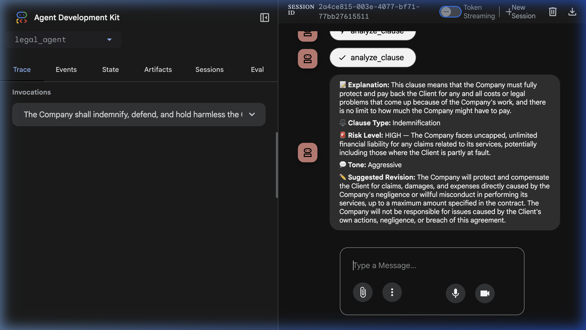
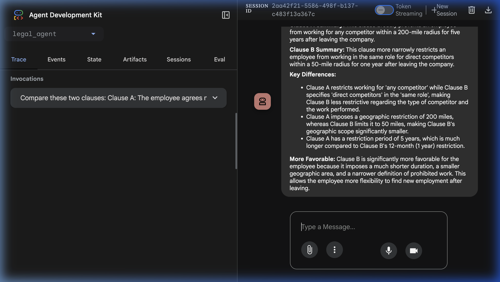

<p align="center">
  <h1 align="center">⚖️ LegalLens</h1>
  <p align="center">
    <strong>AI-Powered Legal Clause Simplifier & Negotiation Assistant</strong>
  </p>
  <p align="center">
    Built with <b>Google ADK</b> · Powered by <b>Gemini 2.0 Flash</b> · Deployed on <b>Cloud Run</b>
  </p>
  <p align="center">
    <a href="https://legal-clause-simplifier-114195605527.europe-west1.run.app">🔗 Live Demo</a> ·
    <a href="#features">Features</a> ·
    <a href="#how-it-works">How it Works</a> ·
    <a href="#setup">Setup</a>
  </p>
</p>

---

## 🚀 What is LegalLens?

LegalLens is an AI agent that helps **freelancers, founders, and SMEs** understand the legal contracts they're about to sign. Paste any dense legal clause and get an instant, jargon-free breakdown — powered by Google's Gemini AI.

> **No lawyer needed. No sign-up required. 100% free.**

---

## ✨ Features

| # | Feature | Description |
|---|---------|-------------|
| 1 | 📝 **Plain English Explanation** | Converts legalese into a 2-sentence summary anyone can understand |
| 2 | 🚨 **AI Risk Assessment** | Flags clauses as HIGH / MEDIUM / LOW risk with detailed reasoning |
| 3 | ⚖️ **Clause Type Detection** | Identifies: Indemnification, NDA, Non-Compete, Termination, Liability, and more |
| 4 | 💬 **Sentiment Analysis** | Reveals the tone: Aggressive, Predatory, Standard, Protective, or Fair |
| 5 | ✏️ **Auto-Generated Fair Rewrite** | For risky clauses, generates a balanced alternative you can propose |
| 6 | 🔍 **Clause Comparison** | Compare two clauses side-by-side — see which is more favorable and why |
| 7 | 📄 **Contract Parsing** | Paste a full contract — automatically extracts and labels every clause |

---

## 📸 Screenshots

### Clause Analysis
> Paste a clause → Get structured AI analysis with risk level, explanation, and a suggested fair rewrite.



### Clause Comparison
> Compare two Non-Compete clauses — the agent identifies key differences and which is more favorable.



---

## 🎯 Example

**Input:**
> "The Company shall indemnify, defend, and hold harmless the Client from and against any and all claims, losses, damages, liabilities, and expenses of whatever nature, without cap or limitation."

**Output:**

> 📝 **Explanation:** This clause means the Company must fully protect and pay back the Client for any and all costs or legal problems, with no limit on how much the Company might have to pay.
>
> ⚖️ **Clause Type:** Indemnification
>
> 🚨 **Risk Level:** HIGH — The Company faces uncapped, unlimited financial liability for any claims related to its services.
>
> 💬 **Tone:** Aggressive
>
> ✏️ **Suggested Revision:** *"The Company will protect and compensate the Client for claims directly caused by the Company's negligence, up to a maximum amount specified in the contract."*

---

## 🛠️ How it Works

```
User pastes a legal clause
        ↓
ADK Agent selects the right tool
        ↓
┌──────────────────────────────────────────┐
│  analyze_clause                          │
│  → Explanation, Type, Risk, Sentiment,   │
│    Fair Rewrite                          │
├──────────────────────────────────────────┤
│  compare_clauses                         │
│  → Summaries, Differences, Which is      │
│    More Favorable                        │
├──────────────────────────────────────────┤
│  extract_clauses                         │
│  → Labeled list of clauses from contract │
└──────────────────────────────────────────┘
        ↓
Agent formats JSON → User-friendly response
```

---

## 🧰 Tech Stack

| Layer | Technology |
|-------|-----------|
| **Agent Framework** | [Google ADK](https://github.com/google/adk-python) v1.14.0 |
| **LLM** | Gemini 2.0 Flash via Vertex AI |
| **API** | Google GenAI Python SDK |
| **Deployment** | Google Cloud Run (serverless) |
| **Logging** | Google Cloud Logging |
| **Language** | Python 3.11 |
| **UI** | ADK Dev UI (built-in) |

---

## 📂 Project Structure

```
legallens-agent/
├── agent.py            # ADK agent + 3 Gemini-powered tools
├── __init__.py          # Package init
├── requirements.txt     # Dependencies
├── .env.example         # Environment variable template
├── assets/              # Screenshots for README
│   ├── screenshot_analysis.png
│   ├── screenshot_comparison.png
│   └── screenshot_landing.png
└── README.md
```

---

## ⚡ Setup

### Prerequisites
- Python 3.11+
- Google Cloud project with Vertex AI enabled
- `gcloud` CLI authenticated

### Local Development
```bash
# Clone the repo
git clone https://github.com/mrmallick07/legallens-agent.git
cd legallens-agent

# Set environment variables
cp .env.example .env
# Edit .env with your GCP project details

# Install dependencies
pip install -r requirements.txt

# Run locally
adk web .
```

### Deploy to Cloud Run
```bash
uvx --from google-adk==1.14.0 \
adk deploy cloud_run \
  --project=$GOOGLE_CLOUD_PROJECT \
  --region=$GOOGLE_CLOUD_LOCATION \
  --service_name=legal-clause-simplifier \
  --with_ui \
  .
```

---

## 🔑 Environment Variables

| Variable | Description | Example |
|----------|-------------|---------|
| `GOOGLE_CLOUD_PROJECT` | Your GCP project ID | `my-project-123` |
| `GOOGLE_CLOUD_LOCATION` | Cloud Run region | `europe-west1` |
| `GOOGLE_GENAI_USE_VERTEXAI` | Enable Vertex AI | `TRUE` |
| `MODEL` | Gemini model name | `gemini-2.0-flash` |

---

## 🌐 Live Demo

🔗 **[https://legal-clause-simplifier-114195605527.europe-west1.run.app](https://legal-clause-simplifier-114195605527.europe-west1.run.app)**

---

## 🏗️ Built For

**Gen AI Academy — APAC Edition** by Google Cloud × H2S

> *Build in APAC. Build for the world.*

---

<p align="center">
  Made with ❤️ by <strong>Hannan Ali Mallick</strong>
</p>